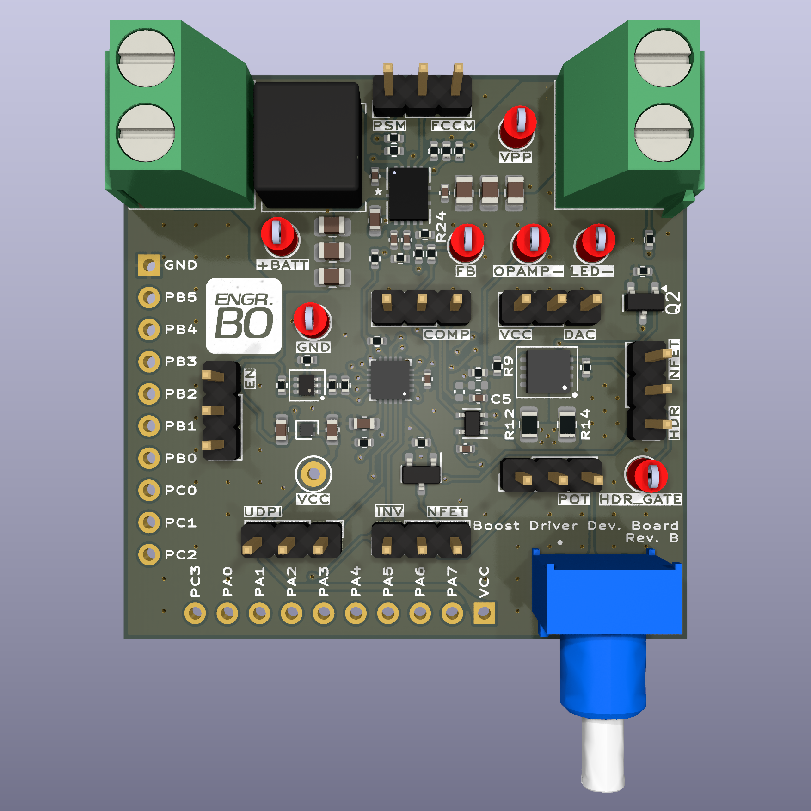

# Flashlight Dev Board Hardware

## Introduction

This repository contains design files for the development board for a flashlight boost driver. The test firmware can be found in the [firmware repository](https://github.com/engineerbo/flashlight-dev-fw).

Also included in the `scripts` subdirectory are Python scripts used to calculate component values during the design process, as well as generate the look-up table for brightness settings.

For a detailed explanation of this project, check out the [video series](https://www.youtube.com/playlist?list=PLYK5tmZIBWtEJjwAFE-49hSeELu9zoAmV) on the [Engineer Bo YouTube channel](https://youtube.com/@engineerbo).

## Features

The development board is designed in [KiCad](https://www.kicad.org/), and features the following:

* ATtiny1616 microcontroller
* MP3432 boost converter
* LED current regulation
  * 1R and 10mR current sense resistances, selectable for high dynamic range (HDR)
  * ATtiny1616 DAC controlled current setpoint
  * Current regulation using TLV333/OPA333 op-amp and MP3432 feedback pin
* Power switch multi-click counting
* Temperature sensing
  * NTC thermistor
  * ATtiny1616 internal temperature sensor
* Battery voltage sensing with low current leakage
* Optional potentiometer for current setpoint (highly experimental)
* Test probe hooks
* Headers for all ATtiny1616 pins
* Many jumpers for testing different configurations

## Usage

This development board is meant to serve as a reference for anybody interested in learning about flashlight boost drivers. It's possible to build these boards, but assembly requires reasonable skill and involves less-than-friendly components e.g. DFN, QFN and many 0402 passives.

Instead, I recommend having a look at the schematics, and leave me a comment on [YouTube](https://www.youtube.com/playlist?list=PLYK5tmZIBWtEJjwAFE-49hSeELu9zoAmV) if you have any questions.

## Hardware Revisions

### Revision A

This is the original design built for testing, and includes a couple of issues:

* GPIO driven P-channel MOSFET for HDR MOSFET gate drive
* MP3432 UVLO not configured
* Wrong footprint for NTC thermistor

These issues and their fixes are explained in detail in the [video series](https://www.youtube.com/playlist?list=PLYK5tmZIBWtEJjwAFE-49hSeELu9zoAmV).

### Revision B

Revision B fixes the issues in Revision A:

* GPIO driven N-channel MOSFET for HDR MOSFET gate drive
* Added MP3432 UVLO
